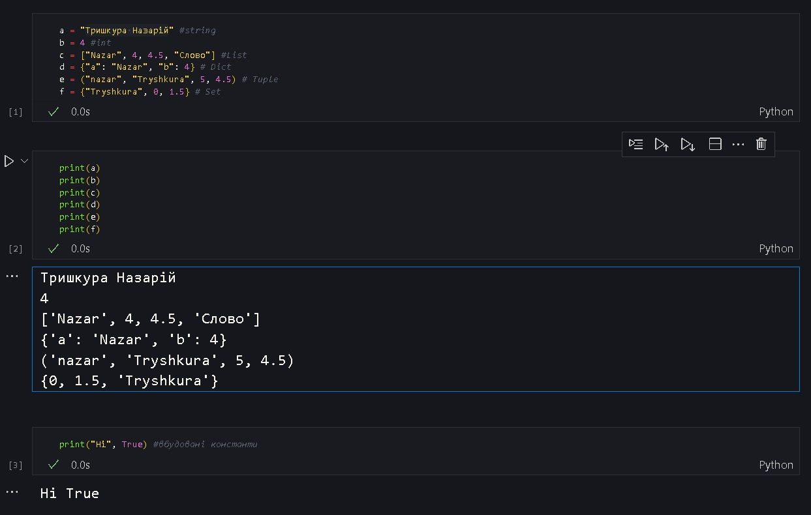
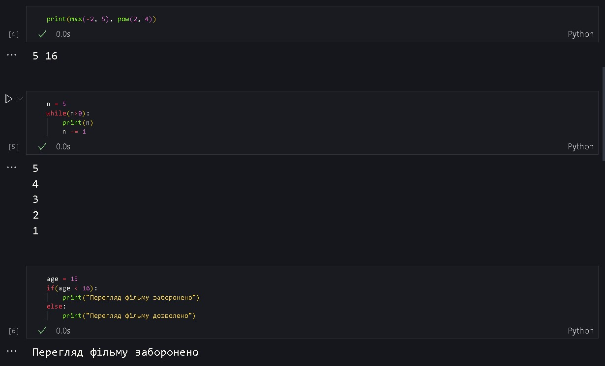
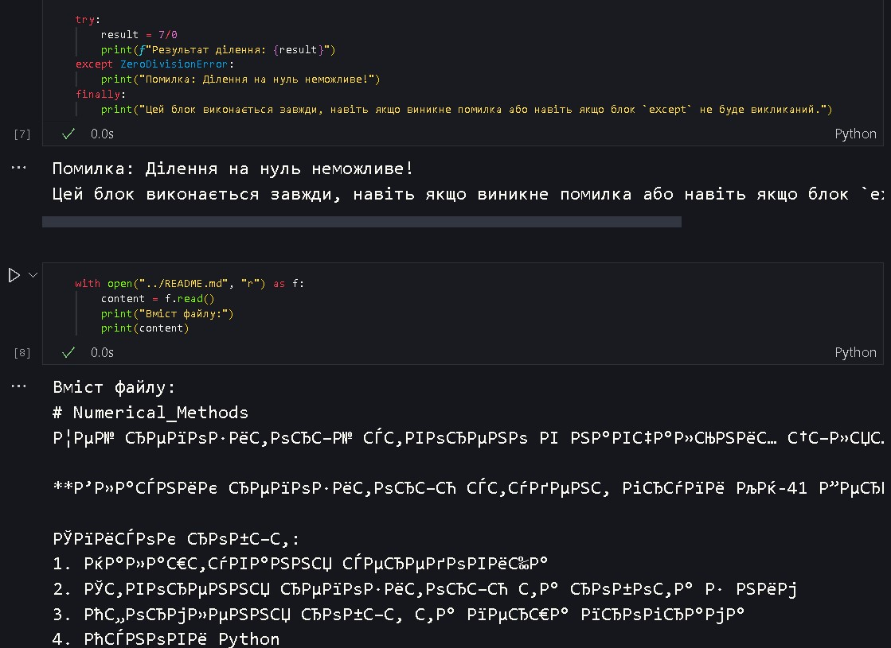
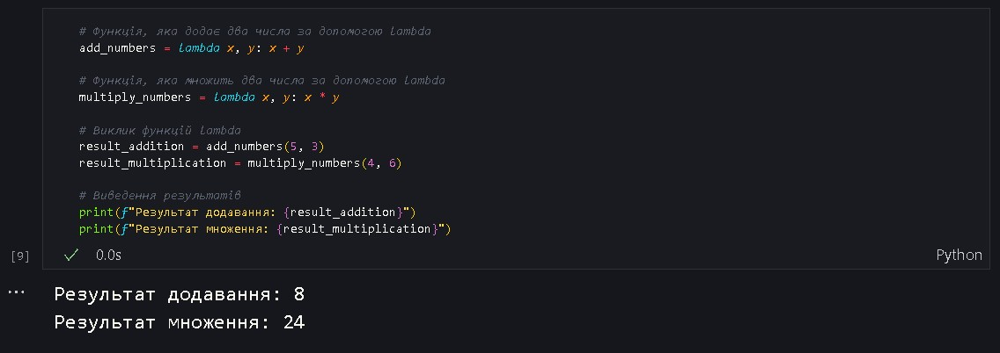

# Звіт до роботи
## Тема: Основи програмування на Python
### Мета роботи: Познайомитись з основними типами данних та кострукціями в мові програмування Python. 

---
### Виконання роботи
* Під час виконання роботи я познайомився і вивів результат роботи наступних конструкцій в Python:
    - основні типи данних.
    - вбудовані константи
    - вбудовані функції
    - цикли
    - розгалуження
    - Конструкція try->except->finally
    - Контекст-менеджер with
    - lambdas
* Результати роботи:
    - 
    - 
    - 
    - 
    

### Висновок:
У ході виконання лабораторної роботи було успішно вивчено та виконано ряд конструкцій в мові програмування Python, що стосуються основних типів даних та базових конструкцій мови. Результати виведені у вигляді скріншотів ілюструють коректне виконання конструкцій та демонструють здатність виводити необхідні результати у процесі виконання коду. Лабораторна робота дала поглиблене уявлення про основи програмування на Python та важливі конструкції мови.