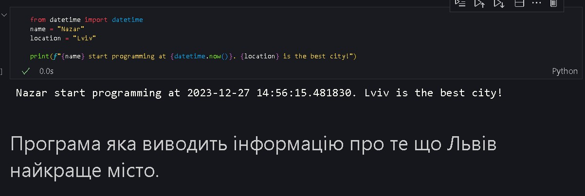
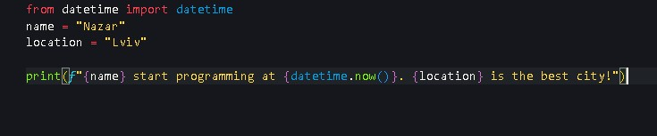

# Звіт до роботи
## Тема: оформлення робіт та перша програма
### Мета роботи: Навчитись оформлювати виконані роботи, налаштовувати середовище для роботи з Python

---
### Виконання роботи
* Під час виконання завдання було зроблено наступні кроки:
    - встановлено плагін Python
    - створено та заповнено новий файл my_first_app.py
    - створено новий файл my_first_program.ipynb, введено код програми та її опис 
    - отримано результати виконання обох программ
* Результати роботи:
    - 
    - 

* Код програми my_first_program.ipynb:
    ```python
    from datetime import datetime
    name = "Nazar"
    location = "Lviv"

    print(f"{name} start programming at {datetime.now()}. {location} is the best city!")
    ```

---
### Висновок:
У ході виконання лабораторної роботи було успішно оформлено виконані завдання та встановлено середовище для роботи з мовою програмування Python. Лабораторна робота допомогла ознайомитися із процесом оформлення робіт та базовими етапами налаштування середовища для роботи з Python. 